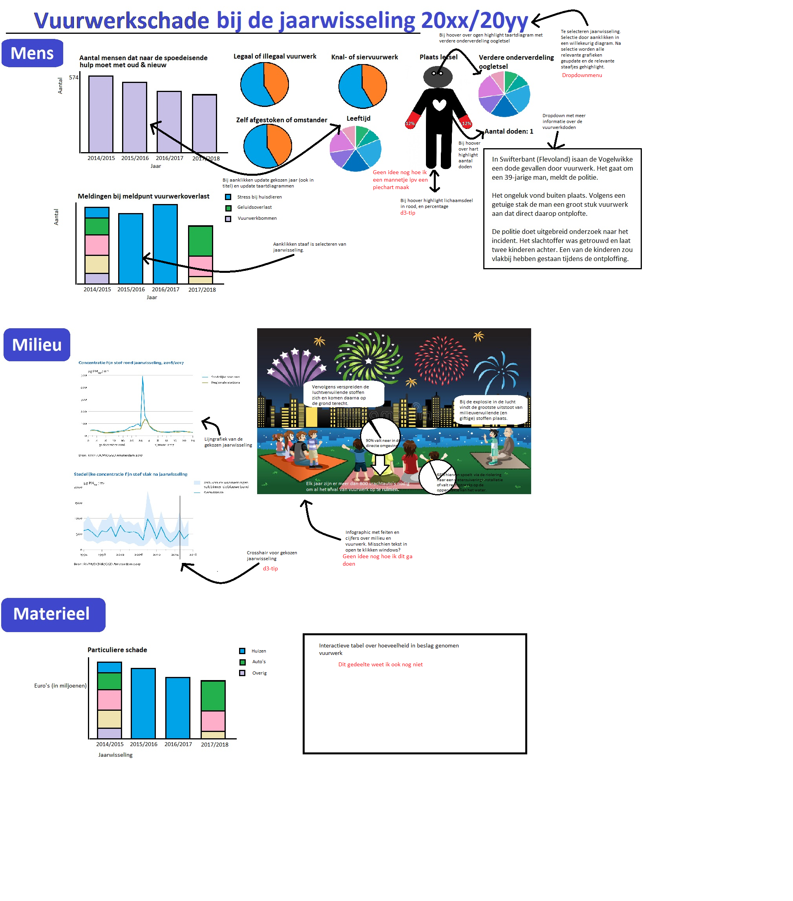
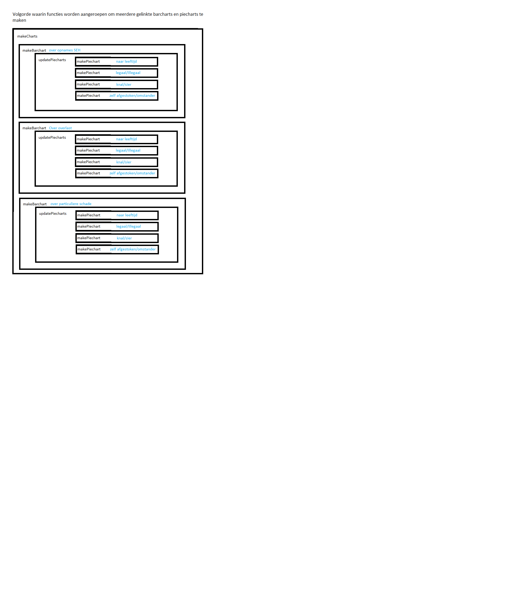

# Vuurwerkschade
#### Orin Habich

### Technische aanpak van de onderdelen in de oplossing
  Hieronder is een lijst met de databronnen. Dit zijn bijna allemaal nieuwsberichten of rapporten.
  De data moet ik dus grotendeels uit tekst halen. Gelukkig zijn het vrij kleine datasetjes per visualisatie.

  Een overzicht en omschrijving van de technische componenten staat in de afbeelding hieronder.

  Voor dit project ga ik in ieder geval gebruiken:
  - bootstrap
  - jqueryAjax
  - queue
  - d3-tip
  
  #### Functies
  Er komen meerdere barcharts en piecharts. De volgende functies ga ik nodig hebben.
  - makeCharts        voor het maken van alle charts
  - makeBarchart      voor het maken van (stacked) barcharts 
  - updatePiecharts   voor het updaten van de piecharts
  - makePiechart      voor het maken van piecharts
  
  In het schema hieronder is te zien in welke volgorde deze worden aangeroepen.

  #### Lijst van databronnen
- https://www.google.nl/amp/s/nos.nl/googleamp/artikel/2011650-70-000-meldingen-bij-meldpunt-vuurwerkoverlast.html
- https://www.nrc.nl/nieuws/2016/01/03/bijna-90-000-meldingen-van-vuurwerkoverlast-a1410391
- https://www.google.nl/amp/s/www.nu.nl/jaarwisseling/4372970/laagste-aantal-klachten-vuurwerkoverlast-in-vijf-jaar.amp
- https://vuurwerkoverlast.nl/
- http://content1a.omroep.nl/urishieldv2/l27m707c500020d6b406005a4f4565000000.d2e5500bbd608cb1dc2887cc7a2fbbb0/nos/docs/030117_vuurwerk.pdf
-  https://vuurwerkmanifest.nl/#cijfers-oogletsels
-  http://www.staakthetvuren.com/Gespreksnotitie%20VITO.pdf
-  https://www.milieucentraal.nl/bewust-winkelen/spullen-en-diensten/vuurwerk/
-  http://www.clo.nl/indicatoren/nl0570-luchtverontreiniging-tijdens-de-jaarwisseling
- https://nos.nl/artikel/2151143-schade-jaarwisseling-geschat-op-13-miljoen-euro.html
- https://l1.nl/content/documents/2016/12/2017-vuurwerkschade.pdf
- https://www.nvshv.nl/wp-content/uploads/2014/12/vuurwerkongevallen-2013-2014.pdf
- https://www.rijksoverheid.nl/binaries/rijksoverheid/documenten/rapporten/2015/04/30/rapport-veiligheid-nl-vervolgonderzoek-vuurwerkongevallen-2014-2015/rapport-veiligheid-nl-vervolgonderzoek-vuurwerkongevallen-2014-2015.pdf
- https://www.veiligheid.nl/.ibmmodres/domino/OpenAttachment/veiligheid/website.nsf/C3229E8087B6F2F5C1257FE100442ADB/asset/Rapport%20631%20Vuurwerk%202015-2016.pdf
- https://www.veiligheid.nl/.ibmmodres/domino/OpenAttachment/veiligheid/website.nsf/2A7658DAEF2FFAC0C125809D005C344C/asset/Ongevallen%20met%20vuurwerk%202016-2017%20v2.pdf
- https://www.veiligheid.nl/.ibmmodres/domino/OpenAttachment/veiligheid/website.nsf/736AD758CB2AB716C125820B0052595F/asset/Rapportage%20vuurwerkongevallen%202017-2018.pdf

