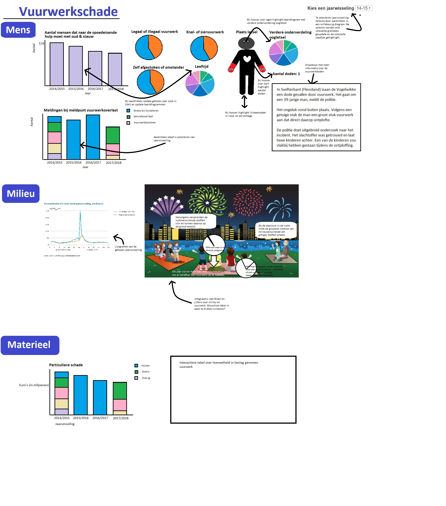
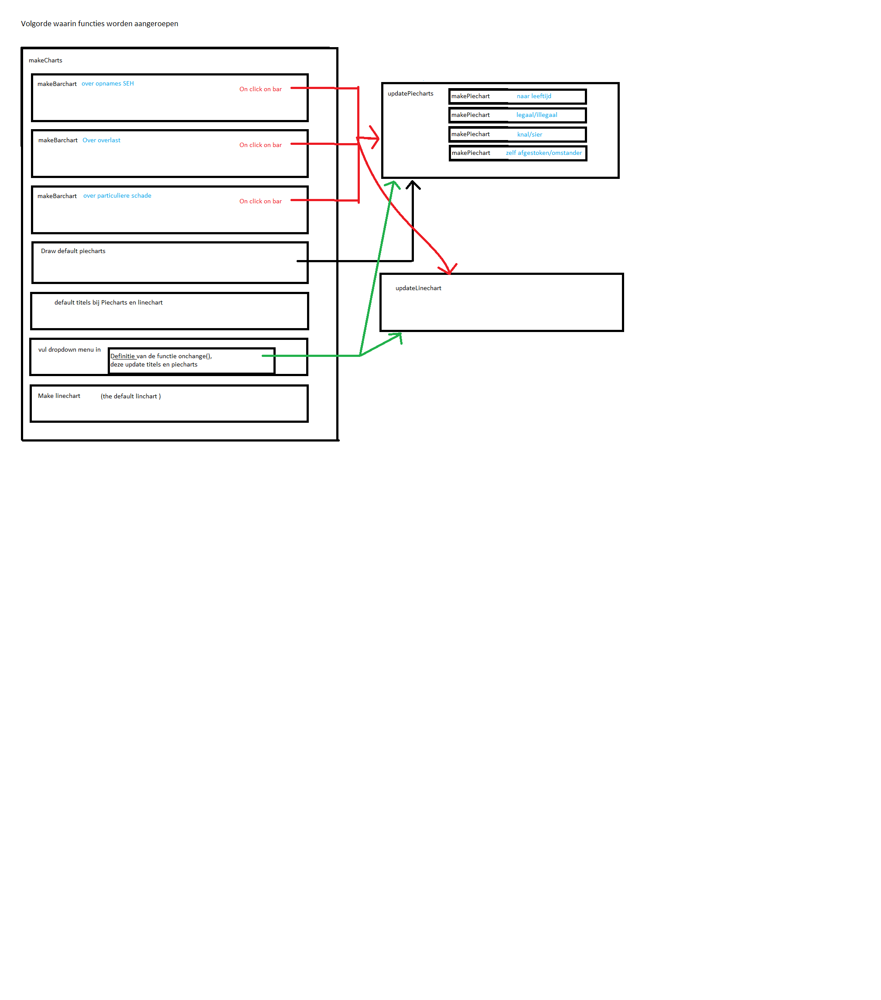
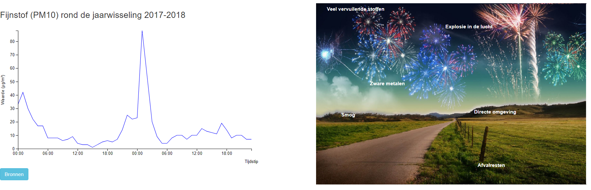
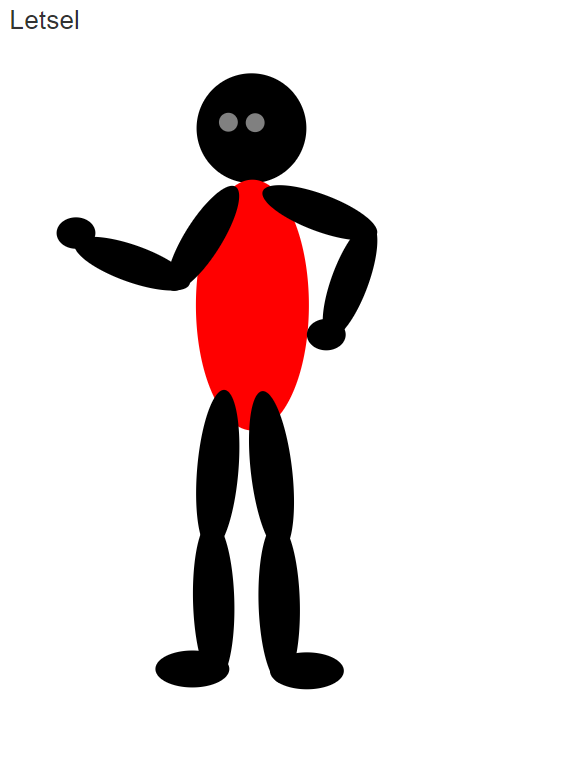
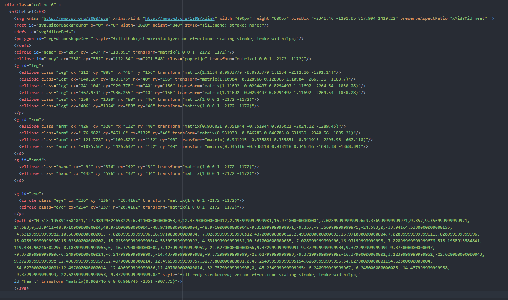
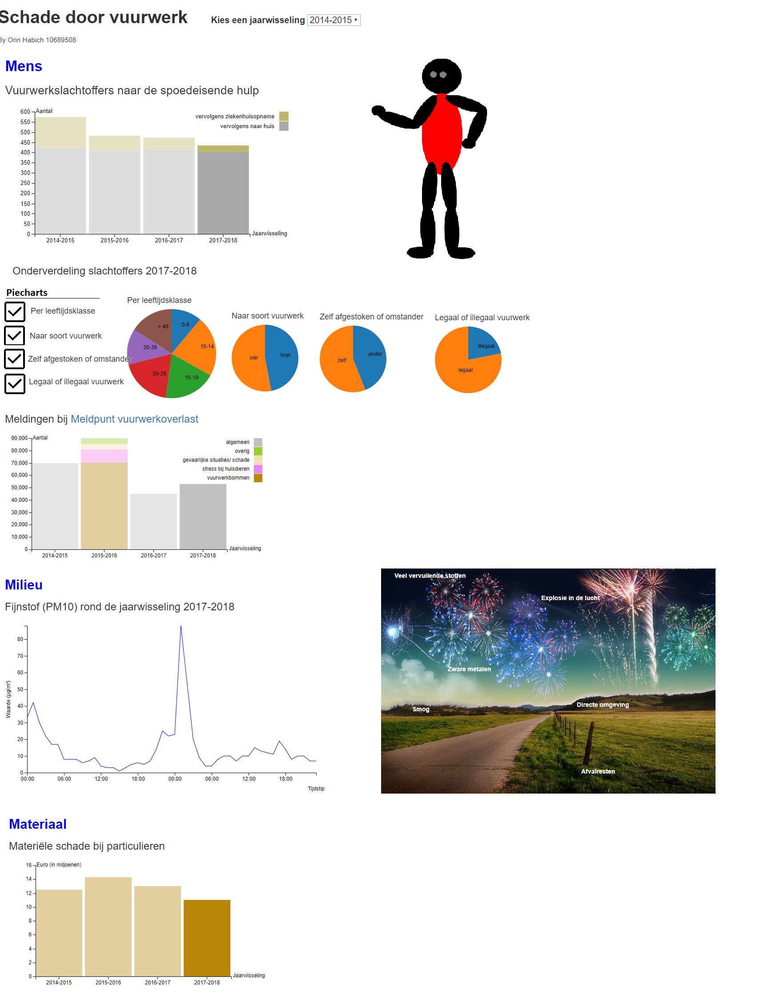
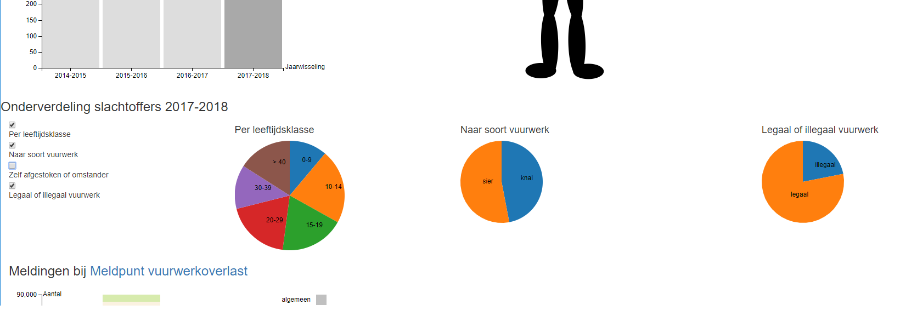
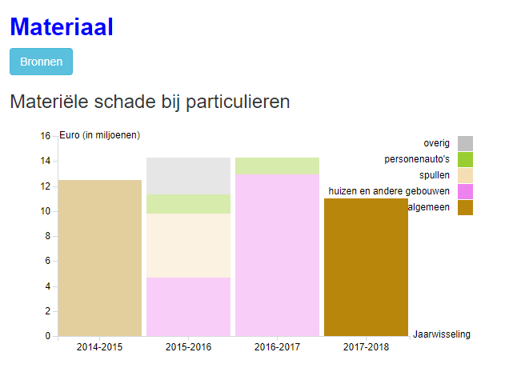
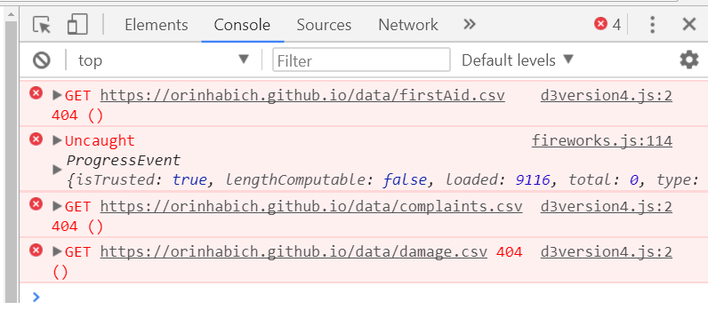

# Vuurwerkschade
#### Orin Habich

# dag 6
Een lijngrafiek is vervallen wegens gebrek aan toegevoegde waarde aan het verhaal.
Voor de andere lijngrafiek heb ik andere data gezocht. Ik wil namelijk alle grafieken over dezelfde jaarwisselingen laten gaan, en bovendien de meest recente jaarwisselingen laten zien.

Van de meest recente jaarwisseling heb ik alleen een interactieve grafiek online waaruit ik waarschijnlijk de benodigde data kan scrapen.
De data voor de lijngrafiek komt niet allemaal in één json file, maar in meerdere csv files.
Dit is enerzijds omdat dit beter matched met de gevonden voorbeelden over linecharts.
Maar vooral omdat ik geen hele grote json files wil met veel indiceer-lagen. Want als ik
een jaarwisseling wil toevoegen moet dat niet te moeilijk gaan.
Ik heb nu een python-scriptje geschreven om de gedownloade data om te zetten naar geschikte csv files.
Dit geeft toch wat problemen met de updateLinechart-functie en de scope van de ingeladen data.
Hiervoor heb ik nu als tijdelijke oplossing om alle datasets mee te geven aan updateLinechart() maar dat kan waarschijnlijk beter.
De flow van het programma begint erg onlogisch te worden.
Het is nu zoals in onderstaand schema.

# dag 7
De updateLinechart functie begint met een aantal if-statements om de data van de gekozen jaarwisseling te selecteren. Liever zou ik deze keuze meegeven aan de functie, ipv zoals nu alle data en de gekozen jaar wisseling meegeven en dan in de functie pas de juiste data selecteren.

Dit wilde ik doen door updateLinechart("fijnstof" + xPosition) te gebruiken.
Maar dit geeft updateLinechart("fijnstof17-18") ipv updateLinechart(fijnstof17-18). Dus een string als input ipv de data.

Vandaar deze oplossing dus met if-statements.

Het plan was om nog een infographic te maken en een poppetje. Met infographic bedoel ik een plaatje met daarop punten die on-hover een tekstvak geven met informatie over vuurwerk en milieu.
De technieken die ik hiervoor nodig heb zijn ongeveer hetzelfde als voor het poppetje, maar simpeler. Daarom probeer ik eerst zo'n infographic te maken.

# dag 7 avond
De infographic is gelukt.

Samen met de linechart er naast vertelt dit mooi het milieu-deel van mijn verhaal.
Voor het poppetje ga ik met http://www.drawsvg.org/drawsvg.html aan de slag.

# dag 8
Er is nu een poppetje:

De lichaamsdelen waarover ik data heb over letsel lichten rood op bij hover over.
Het poppetje is een svg bestaande uit een tiental componenten die allemaal in de html staan nu, omdat ze allemaal apart toegankelijk moeten zijn. Erg mooi is dit niet, de svg beslaat het volledige screenshot hieronder.

Een alternatief schijnt te zijn om php te gebruiken met als syntax 
>\<?php echo file_get_contents("icons/my-icon.svg"); ?\>

Maar dit doet helaas niks.

Bij het poppetje moet nu nog een tooltip komen.

Het originele plan was om bij de ogen een verdere onderverdeling te geven met oogletsel.

Er zijn een aantal problemen hierbij.
1.  Van afgelopen jaarwisseling is helaas geen data te vinden.
2.  De andere data matched niet helemaal met de SEH data (spoedeisende hulp en behandeling door oogarts zijn verschillende datasets )
3.  De data over ogen is deels geschikt voor een piechart (blijvend/niet blijvend letsel). Maar het meest interesante deel is meer geschikt voor in een barchart (aantal visusverlies, blind, oog verwijderd). Dit moet dan wel weer een ander soort barchart worden dan die ik nu heb (een andere x-as en met een update-functie).

Voorlopig wegen de nadelen niet op tegen de voordelen vind ik, want de informatie over de ernst van het oogletsel kan ik ook in de tooltip kwijt.

Kortom, het design van de pagina wordt ietsje aangepast.
Het huidige plan is 

Een idee is om met checkboxes aan te geven welke piechart gemaakt moeten worden. Dit in plaats van de interactieve tabel over in beslag genomen vuurwerk.
Voor zo'n tabel moeten weer allerlei andere datasets gezocht worden en het sluit niet helemaal aan op mijn verhaal.

# dag 9
Mijn site wordt Nederlandstalig, maar alle code moet begrijpelijk zijn voor Engelstalige mensen vind ik. Alle variabele en functienamen heb ik daarom veranderd.

Ik heb erg veel duplicate code. Zoals alle variabelen voor barcharts en piecharts en de tooltips over het poppetje.
Het lukt nog niet erg om dit te verbeteren.
For-loops zouden uitkomst moeten bieden maar deze geven onverwachtte resultaten.

Dit is nu de todo lijst:

1.  Checkboxes werkend maken (aangenomen dat het als vervanging voor de interactieve tabel mag)
2.  Een tooltip aan de linegraph toevoegen
3.  Uitzoeken of ik dropdown menu kan updaten
4.  Misschien sterfgevallen toevoegen aan tooltip bij poppetje
5.  Duplicate code oplossen
6.  Opmaak site mooi maken
7.  Design en style code verbeteren
8.  Stap 6 en 7 herhalen

# dag 9 avond
De checkboxes werken.

Niet mooi nog: 
Er is nu voor iedere checkbox een andere functie. Deze functies zijn bijna identiek en het zou veel beter worden als het zou lukken om een argument aan de functie mee te geven.

Bij het openen van de site zijn de checkboxes unchecked en de piecharts invisible. Dat lijkt mij het meest logisch denk ik.

De piecharts bestaan gewoon als ze unchecked zijn, maar zijn onzichtbaar. Dit is ietsje langzamer voor de gebruiker die de checkboxes helemaal niet aan-checked, maar veel simpeler qua code.

Als alleen de onderste checkbox aanstaat, dan staat die piechart helemaal rechts. Dat is niet zo mooi maar ik moet nog bedenken wat ik daar aan doe.

# dag 10
Bij de presentatie ontdekt dat de checkboxes nog buggy zijn in combinatie met de barcharts.

Als feedback kreeg ik dat de piecharts in één sunburst zouden kunnen.
Dit is best een goed idee want een sunburst is tof en interesanter dan piecharts.
Er is geen samenhang in de data van de variabelen van de piecharts, maar dat is niet per sé nodig voor een sunburst.

Ik twijfel nog of ik het ga doen. Hier is een tabel met mijn voors en tegens.

| Voor                                 | Tegen                                                                     |
| ------------------------------------ |:-------------------------------------------------------------------------:|
| Sunburst is cool                     | Piecharts heb ik al, zonde van werk om nu weer iets anders ervan te maken |
| piecharts zijn misschien te simpel   | Checkboxes vervallen bij sunburst, dus daar moet ik dan weer iets nieuws voor verzinnen en maken. Dubbel werk dus!  |
| Data wordt compacter gevisualiseerd  | In mijn doelgroep zitten ook laagopgeleiden mensen. Daarom wil ik alle data zo simpel en begrijpelijk mogelijk presenteren. Vandaar ook de piecharts, dit sluit beter aan bij de doelgroep denk ik. Een sunburst is compacter maar ook complexer. Dat vind ik interessanter, maar dat is een slechte reden voor design vindt ik |
|    | Met de piecharts voldoe ik evengoed aan de eisen van het project denk ik, want ik heb ook het poppetje en dat maakt het weer ietsje complexer.  |

# dag 11
Ziek

# dag 12
Het onderdeel over materiële schade vind ik mager. Het zou leuk zijn als er nog iets bij kwam hier, maar er is geen goede data over te vinden. Ik heb wel van twee jaarwisselingen een onderverdeling gevonden maar deze sluiten slecht op elkaar aan. Het ziet er ook niet aannemelijk uit dat die onderverdelingen kloppen. Daarom haal ik dat er weer uit.

Het verhaal dat bij de cijfers over materiële schade hoort is het volgende.
1.  Er is veel schade ieder jaar.
2.  Maar we geven met zijn allen nog veel meer uit aan vuurwerk ieder jaar. Vuurwerk levert de maatschappij dus netto geld op.
3.  Maar we kijken nu alleen naar materiële schade, er zijn nog veel meer kosten voor de maatschappij. Als we die kosten meerekenen komen we netto juist negatief uit. 
Het volgende rekenplaatje maakt dit duidelijk.

>Maar de echte schade zit in het verlies van levenskwaliteit. Als we het leed van lichamelijke schade uitdrukken in geld, is het bedrag >schrikbarend. Het Oogziekenhuis gebruikte daarvoor de Qaly-maatstaf, waarmee verlies van levenskwaliteit wordt uitgedrukt in >economische waarde.
>
>Als voorbeeld geeft de OVV het verlies van een oog op achtjarige leeftijd. De 'kosten' daarvan worden jaarlijks uitgedrukt als 12.500 >euro. Op een mensenleven levert dat een miljoen euro aan leed op.
>
>In negen jaar tijd gingen er 158 ogen verloren door vuurwerk bij mensen met een gemiddelde leeftijd van 20 jaar. Ervan uitgaande dat >zij 88 jaar worden, levert dat een kostenplaatje op van 134,3 miljoen euro. Alleen al aan verloren levenskwaliteit door oogschade dus.
>
>Alles bij elkaar opgeteld kost het jaarlijkse feest de maatschappij dus zeker 30 miljoen euro, waarbij moet aangetekend worden dat we >veel kosten dus nog niet eens kennen. 
>
>Bron: https://www.rtlz.nl/algemeen/binnenland/zo-hoog-zijn-de-kosten-van-oud-en-nieuw

Het probleem voor mijn visualisaties is dat er hier geen harde cijfers meer zijn. Bovenstaand stukje is al een vrij wilde schatting. Dit in een visualisatie stoppen zou teveel natte-vinger-werk worden naar mijn smaak.

De duplicate code voor de piecharts is opgelost, voor de tooltips op het poppetje heb ik een for-loop als oplossing. Een oplossing zonder for-loop is mooier en mogelijk, maar lukt nog niet. Het inladen van de svg van het poppetje lukt nu ook. Dus die svg staat niet meer geheel in index.html.

De dataset voor de linegraph bestond uit losse csv files. Dat leek mij vorige week nog een goed idee. Bij nader inzien vind ik één json-file toch logischer. Daarom heb ik dit veranderd. Nu zijn alle datasets waarmee ge-update wordt van dezelfde structuur.

# Dag 13
Voornaamste issue op dit moment is dat ik meerdere stukjes code zodanig gemaakt heb dat acties van de gebruiker de DOM laat groeien.
Door .append() te gebruiken in .on("click) bijvoorbeeld.
Een voorbeeld hiervan is makePiechart(), die een hele nieuwe piechart over de oude maakt, terwijl de oude ook blijft bestaan.

Iets anders dat ik wil veranderen aan de makePiechart is dat als de data geupdate wordt de piechart in hetzelfde tempo veranderd als de linechart. En niet in 0 seconden zoals nu.

Beide problemen los ik op door een updatePiechart() functie te maken, similar aan de updateLinechart() functie.

Zo'n updatePiechart() functie heb ik gemaakt. Deze werkt wel, maar bevat rare bugs en geeft een error. 

Een ander probleem is dat ik de mappenstructuur in mijn repository heb aangepast en in github pages de databestanden vaak niet meer gevonden worden.

Ik zie wat er verkeerd gaat denk ik (de folder "project" wordt overgeslagen, het moet zijn *https://orinhabich.github.io/project/data/firstAid.csv* )
Maar ik weet niet hoe ik dit verander of waarom sommige datafiles wel gevonden worden.
