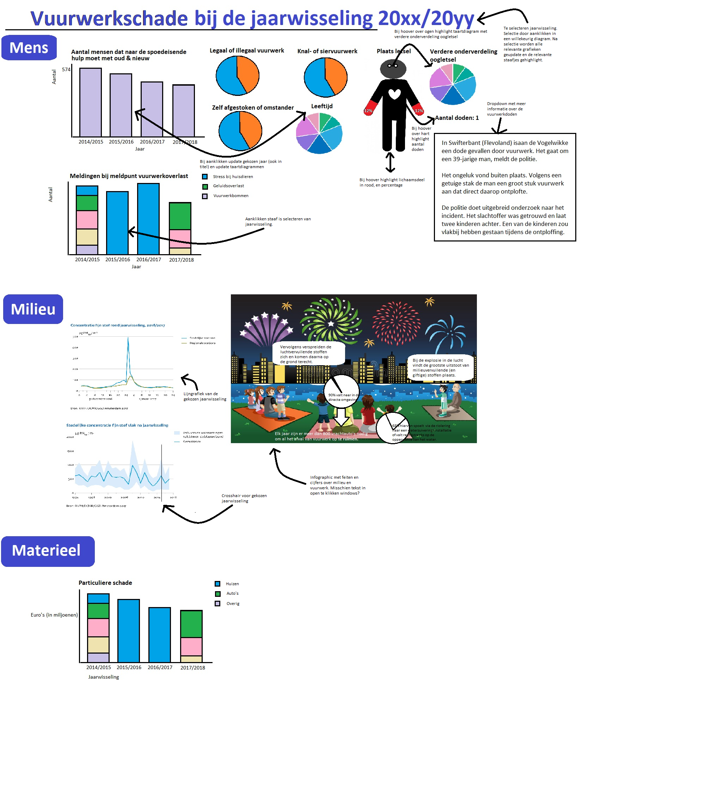

# Vuurwerkschade 
#### Orin Habich

### 1. Probleemstelling
Over het algemeen zijn mensen zich onvoldoende bewust van de hoeveelheid schade door vuurwerk. 
De discussie rondom vuurwerk slingert meestal tussen "het is traditie" en "het veroorzaakt veel schade."
Dit laatste argument is veelomvattend en rationeel, maar de informatie over vuurwerkschade is erg versnipperd en ontoegankelijk. 

### 2. Oplossing
In één zin is de beoogde oplosing een beknopte heldere website met visualisaties van data over drie soorten vuurwerkschade: schade aan mensen (zoals letselschade), schade aan milieu (zoals fijnstof) en materiële schade (zoals brand).  
De **doelgroep** bestaat uit mensen die snel en makkelijk een overzicht willen van vuurwerkschade. Het **niveau** is toegankelijk, bij voorkeur is de website begrijpelijk voor kinderen vanaf 12 jaar.

### 3. Gedetailleerde omschrijving van de oplossing
Zie de schets onderaan. Alles staat bij voorkeur op één pagina. De visualisaties zijn ingedeeld naar Mens, Milieu en Materieel. 
 ### Mensen
 #### Letsel 

- Een staafdiagram geeft het aantal mensen dat tijdens een jaarwisseling naar de spoedeisende hulp moest. Het aanklikken van een staafje selecteert een jaarwisseling. 
- Taartdiagrammen geven diverse aspecten (zoals leeftijdsverdeling) bij de gekozen jaarwisseling.
- Voor de plaats van het letsel is een poppetje in plaats van een taartdiagram. De ledematen en percentages highlighten bij mouse-over.  - Bij mouse-over over de ogen verschijnt een taartdiagram met een verdere specificatie van de soorten oogletsel. 	                       - Het hart geeft het aantal doden door vuurwerk. Daarbij zit een knop voor meer informatie over deze sterfgevallen.

 ####  Overlast
  - Een staafdiagram met het aantal meldingen van overlast door vuurwerk bij Meldpunt Vuurwerkoverlast per jaarwisseling. Per staaf is er een onderverdeling naar soort overlast (indien deze data gevonden wordt.)

### Milieu
- Een infographic over de vervuiling. 
- Een lijngrafiek met de gemiddelde hoeveelheid smog met crosshair die (net als het staafje in de barchart hierboven) een jaarwisseling selecteert. 
- Een lijngrafiek die de piek in concentratie fijnstof rond de jaarwisseling weergeeft. 
Deze twee lijngrafieken zijn zoals [hier](http://www.clo.nl/indicatoren/nl0570-luchtverontreiniging-tijdens-de-jaarwisseling).

### Materieel
- Een staafdiagram met de hoeveelheid schade per jaarwisseling.  Het aanklikken van een staafje selecteert een jaarwisseling. Per staaf is er een onderverdeling naar soort schade (indien data gevonden wordt.)

### 4. Minimale onderdelen en optionele onderdelen
Minimaal moeten de staafdiagram met het aantal mensen dat tijdens een jaarwisseling naar de spoedeisende hulp moest erin, de taartdiagrammen die hierbij horen, de infographic over milieuvervuiling door vuurwerk, de piek in luchtvervuiling rond de jaarwisseling en de hoeveelheid schade.
Optioneel zijn het poppetje met het letsel en de staafdiagram met meldingen van vuurwerkoverlast. Er zou wellicht ook interactiviteit aan de infographic toegevoegd kunnen worden.

### 5. Vereisten
Het doel is zoveel mogelijk relevante data weer te geven. Deze data blijkt erg versnipperd en zal grotendeels uit nieuwsberichten en rapporten komen. Dit betekent dat het voorbereiden van de data veel werk gaat kosten, maar het is ook een extra motivatie voor het maken van de website.
  #### Lijst van databronnen 
- https://www.google.nl/amp/s/nos.nl/googleamp/artikel/2011650-70-000-meldingen-bij-meldpunt-vuurwerkoverlast.html
- https://www.nrc.nl/nieuws/2016/01/03/bijna-90-000-meldingen-van-vuurwerkoverlast-a1410391
- https://www.google.nl/amp/s/www.nu.nl/jaarwisseling/4372970/laagste-aantal-klachten-vuurwerkoverlast-in-vijf-jaar.amp
- https://vuurwerkoverlast.nl/
- http://content1a.omroep.nl/urishieldv2/l27m707c500020d6b406005a4f4565000000.d2e5500bbd608cb1dc2887cc7a2fbbb0/nos/docs/030117_vuurwerk.pdf
-  https://vuurwerkmanifest.nl/#cijfers-oogletsels	
-  http://www.staakthetvuren.com/Gespreksnotitie%20VITO.pdf
-  https://www.milieucentraal.nl/bewust-winkelen/spullen-en-diensten/vuurwerk/
-  http://www.clo.nl/indicatoren/nl0570-luchtverontreiniging-tijdens-de-jaarwisseling 
- https://nos.nl/artikel/2151143-schade-jaarwisseling-geschat-op-13-miljoen-euro.html
- https://l1.nl/content/documents/2016/12/2017-vuurwerkschade.pdf
- https://www.nvshv.nl/wp-content/uploads/2014/12/vuurwerkongevallen-2013-2014.pdf
- https://www.rijksoverheid.nl/binaries/rijksoverheid/documenten/rapporten/2015/04/30/rapport-veiligheid-nl-vervolgonderzoek-vuurwerkongevallen-2014-2015/rapport-veiligheid-nl-vervolgonderzoek-vuurwerkongevallen-2014-2015.pdf
- https://www.veiligheid.nl/.ibmmodres/domino/OpenAttachment/veiligheid/website.nsf/C3229E8087B6F2F5C1257FE100442ADB/asset/Rapport%20631%20Vuurwerk%202015-2016.pdf
- https://www.veiligheid.nl/.ibmmodres/domino/OpenAttachment/veiligheid/website.nsf/2A7658DAEF2FFAC0C125809D005C344C/asset/Ongevallen%20met%20vuurwerk%202016-2017%20v2.pdf
- https://www.veiligheid.nl/.ibmmodres/domino/OpenAttachment/veiligheid/website.nsf/736AD758CB2AB716C125820B0052595F/asset/Rapportage%20vuurwerkongevallen%202017-2018.pdf

