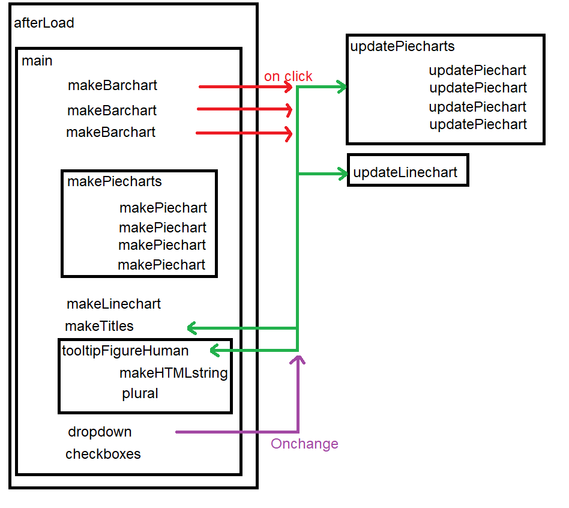

## Omschrijving

Een website met visualisaties over vuurwerkschade. Deze visualisaties zijn gecentreerd rond drie m's: schade aan mensen, schade aan milieu en materiële schade.  

## Het technische ontwerp
Er is één html-pagina voor de site. Dit is index.html.
De functionaliteit is verdeeld over meerdere JavaScript files.
Er is een main.js welke wordt uitgevoerd na het laden van de pagina.
Verder zijn er barcharts.js, linechart.js, piecharts.js en helpers.js.

Op twee manieren kan de data op de webpagina veranderd worden.

De eerste manier is door een staaf in één van de drie staafdiagrammen aan te klikken. Dit zorgt dat de taartdiagrammen en de lijngrafiek worden geupdate naar de jaarwisseling van de aangeklikte staaf. Ook de titels worden aangepast, en de keuze in het dropdown menu.

De tweede manier is doormiddel van het dropdown menu.

Met de checkboxes is aan te geven welke taartdiagrammen zichtbaar moeten zijn.

## Ontwikkeling

### data zoeken
Vanaf het begin was duidelijk dat er veel kleine datasets nodig zouden zijn.
Eerst moest worden uitgezocht hoe deze datasets op elkaar aan gingen sluiten, en in hoeverre deze binnen het verhaal gingen passen.
Vooral de data over de afgelopen jaarwisseling compleet krijgen was een google-uitdaging.

Op zich was het voor het doel van de website niet essentieel om data van meerdere jaren te hebben, maar dit maakt het
verhaal wel sterker. Data van slechts één jaar kan immers ook op toeval berusten. Door data van meerdere jaarwisselingen te laten zien, zie je ook een ontwikkeling over de tijd.
De data van de meest recente jaarwisseling is naar mijn mening wel essentieel.

### staafdiagrammen
In het staafdiagram over overlast van vuurwerk wilde ik graag een onderverdeling maken
naar soort klacht. Deze verdeling heb ik van slechts twee jaarwisselingen kunnen vinden, maar daarmee voegt het alsnog iets toe.
Dat niet iedere staaf in dit diagram uit dezelfde componenten bestaat, heb ik opgelost door sommige
componenten op 0 te zetten in de dataset. De tooltip merkte dit helaas wel op. Dus er kwam dan '0 klachten' te staan
bijvoorbeeeld. Een if-statement loste dit op.

In het staafdiagram over materiële schade wilde ik ook een onderverdeling. De data die ik vond bleek bij nadere inspectie helaas inconsistent en dubieus. Daarom heb ik deze eruit gelaten. Hierdoor was een legenda ook niet meer nodig bij dit staafdiagram.

### taartdiagrammen
De taartdiagrammen hadden eventueel ook in één sunburst gekund. Dit zou echter weinig toevoegen omdat de data daar niet de geschikte
structuur voor heeft. Taartdiagrammen zijn simpeler en gezien de gekozen doelgroep had dat mijn voorkeur.

De checkboxes bij de taartdiagrammen zijn gemaakt in plaats van de interactieve tabel over illegaal vuurwerk.
Deze tabel paste bij nader inzien toch niet zo goed binnen het verhaal.

### lijngrafiek
De lijngrafiek was een concreet idee met een voor de hand liggende uitvoering. Toch vertelt deze grafiek naar mijn smaak niet genoeg. Daarom heb ik een infographic bedacht voor ernaast. In deze infographic kon ik feiten en cijfers kwijt die het onderwerp vuurwerk en milieu aanvullen.

### het poppetje
Het poppetje leek mij een leuke en originele visualisatie, maar ik had geen idee hoe ik zoiets kon maken.
Verrassend genoeg bestaan er dus teken-programmaatjes om svg's mee te maken.
In dit geval heb ik http://www.drawsvg.org/drawsvg.html gebruikt.
Hierin kunnen id's en class names meegegeven worden aan alle componenten van de tekening.

Aanvankelijk was het idee om het poppetje op een aantal punten aan te vullen met een extra visualisatie of element. Zo wilde ik voor de ogen een extra onderverdeling maken in een taartdiagram.
Dit zou dan wel suggereren dat het een onderverdeling van dezelfde groep is als de andere taartdiagrammen.
Patiënten van de spoedeisende hulp en de oogarts zijn echter twee verschillende groepen.
Het was daarom niet duidelijk wat bij een taartdiagram over oogletsel het totaal moest zijn.
Uiteindelijk kwam het er op neer dat de extra data over oogletsel makkelijker en beter in de tooltip kon staan.
Dit gold ook voor de dodelijke vuurwerkslachtoffers.

## beslissingen
Uiteindelijk was het bij elkaar sprokkelen van alle data mijn grootste struikelblok. Met de data die ik uiteindelijk gevonden heb, heb ik precies kunnen maken wat ik in mijn hoofd had. Als de gevonden data uitgebreider en complexer zou zijn geweest had ik interesantere visualisaties kunnen maken. In dat opzicht is het zoeken van een geschikt onderwerp met passende data echt een lastige stap. Aan de andere kant heb ik nu wel iets kunnen maken wat nog niet bestond, iets wat best opmerkelijk is gezien de jaarlijks terugkerende discussie over een vuurwerkverbod voor consumenten. Als ik meer tijd gehad zou hebben zou ik, in plaats van de data uit nieuwsberichten filteren, datasets opvragen bij de desbetreffende partijen. 
